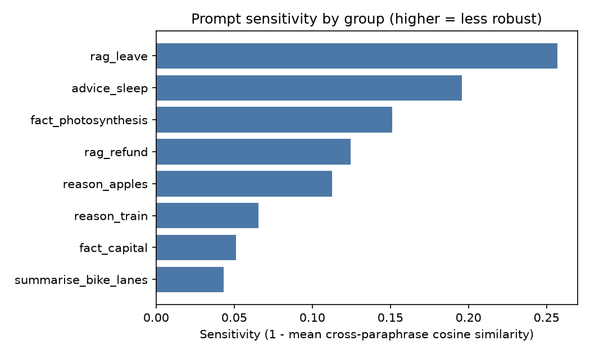
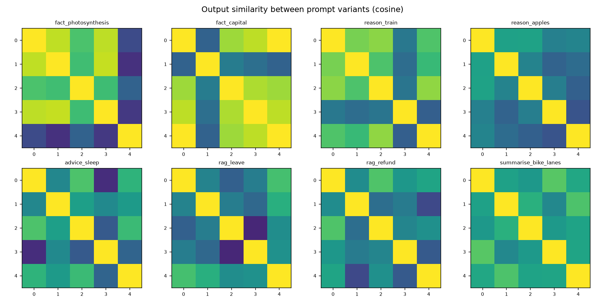

# Prompt Sensitivity Analyser — LLM Reliability & Evaluation Tool

Quantifies **how much an LLM's answer changes when only the wording of the prompt changes**.

For each group of semantically equivalent prompts (paraphrases) the tool generates outputs, embeds them with
Sentence-Transformers, and measures cosine similarity across the paraphrase variants. It also repeats each prompt
several times to measure plain sampling noise, so wording effects can be separated from randomness. Everything is
seeded and reproducible, and results come with bootstrap confidence intervals.

```
prompt variants ──► backend (HF / Ollama / your own function) ──► outputs
                                                                   │
                     sentence-transformers embeddings ◄────────────┘
                                   │
     cosine matrix per group ──► sensitivity, within-prompt noise baseline, lexical/exact-match,
                                 fragile variants, prompt-vs-output correlation ──► report.md / CSV / PNG
```

## Results

Two small open models served locally with Ollama were compared on the same prompts, settings and embedder.

**Setup:** 8 prompt groups x 5 paraphrases (the first 8 of the 10 bundled groups: factual, reasoning, open-ended,
RAG-style and summarisation) | 3 samples per paraphrase = 120 generations per model | temperature 0.7 | seed 0 |
max 64 new tokens | embedder `sentence-transformers/all-MiniLM-L6-v2` .

### Headline numbers

| Metric | Llama 3.2 3B | Qwen 2.5 1.5B |
|---|---|---|
| **Mean sensitivity** (1 − cosine) | **0.125** (95% CI 0.082 – 0.176) | **0.138** (95% CI 0.089 – 0.195) |
| Median / max sensitivity | 0.118 / 0.257 | 0.119 / 0.308 |
| Mean cross-paraphrase output similarity | 0.875 | 0.862 |
| Mean within-paraphrase similarity (sampling noise) | 0.924 | 0.901 |
| **Mean excess sensitivity** (within − between) | **0.049** | **0.040** |
| Mean lexical (Jaccard) similarity | 0.514 | 0.450 |
| Mean exact-match rate across paraphrases | 2.2% | 2.8% |
| Prompt-sim vs output-sim Spearman (pooled) | 0.339 | 0.391 |
| Mean reference-similarity spread | 0.088 | 0.095 |

### Per-group sensitivity (most sensitive first, ordered by Llama)

| Group | Category | Sensitivity: Llama / Qwen | Excess: Llama / Qwen | Within sim: Llama / Qwen |
|---|---|---|---|---|
| rag_leave | rag_style | 0.257 / 0.308 | 0.102 / 0.101 | 0.845 / 0.793 |
| advice_sleep | open_ended | 0.196 / 0.188 | 0.095 / 0.026 | 0.899 / 0.838 |
| fact_photosynthesis | factual | 0.151 / 0.166 | 0.101 / 0.059 | 0.950 / 0.892 |
| rag_refund | rag_style | 0.124 / 0.119 | 0.016 / 0.066 | 0.891 / 0.947 |
| reason_apples | reasoning | 0.113 / 0.119 | 0.014 / 0.013 | 0.902 / 0.894 |
| reason_train | reasoning | 0.066 / 0.098 | 0.047 / 0.045 | 0.982 / 0.947 |
| fact_capital | factual | 0.051 / 0.017 | 0.009 / 0.007 | 0.958 / 0.990 |
| summarise_bike_lanes | summarisation | 0.043 / 0.094 | 0.006 / 0.003 | 0.963 / 0.908 |





Full reports: [`example_results/llama3.2-3b/report.md`](example_results/llama3.2-3b/report.md) and
[`example_results/qwen2.5-1.5b/report.md`](example_results/qwen2.5-1.5b/report.md).

### What the results show

1. **Both models keep their meaning when the wording changes.** Output embeddings for different paraphrases are
   86–88% similar on average, even though almost no outputs are textually identical (exact-match rate 2–3%,
   lexical overlap 45–51%). Rewording changes the words far more than it changes the content.
2. **The two models cannot be told apart on this data.** Mean sensitivity differs by only 0.013 (0.125 vs 0.138) and the
   confidence intervals overlap almost completely. Llama is lower in 5 of 8 groups and Qwen in 3, so there is no
   evidence that either is more robust to rewording. The one clear difference is sampling stability: repeated answers
   to the *same* prompt are more alike for Llama (within-paraphrase similarity 0.924 vs 0.901).
3. **Most of the variation is sampling noise, not wording.** At temperature 0.7, same-prompt samples already differ
   by 1 − within = 0.076 (Llama) and 0.099 (Qwen). The extra dissimilarity attributable to wording (excess
   sensitivity) is 0.049 and 0.040. That is roughly **39% of total variation for Llama and 29% for Qwen** being
   caused by the wording itself; the rest would appear even if the prompt never changed. Excess is positive for every
   group in both models, so wording has a small but consistent effect.
4. **Sensitivity depends more on the question type than on the model.** Both models rank `rag_leave` as most sensitive
   (0.257 / 0.308) and short factual lookup (`fact_capital`, 0.051 / 0.017) as nearly invariant. In `rag_leave` the
   answers agree on the fact (5 days) but differ in form, from a bare "5" (Qwen, variant 0) to a full sentence, which
   embedding similarity penalises. This is a limit of the metric as much as a model weakness (see Limitations).
5. **The fragile prompts follow a pattern: they change register or framing, not just vocabulary.** The most fragile
   variants are consistent across the two models: `advice_sleep` v3 ("I have trouble sleeping. Any advice?", mean
   similarity to the other variants 0.736 / 0.704 for Llama / Qwen), which triggers an empathetic opener ("I'm sorry to hear…"), and
   `fact_photosynthesis` v4 ("In simple terms, how do plants make food from sunlight?", 0.725 / 0.768 for Llama / Qwen), which shifts
   the answer to a simplified explanation. Plain synonym swaps ("Explain…", "Describe…", "Tell me…") stayed close.
6. **Differently worded prompts do produce more different outputs.** The pooled rank correlation between prompt
   similarity and output similarity is positive in both runs (0.339 and 0.391), a moderate effect.

### Limitations

* **Small sample.** 8 groups and one seed, so intervals are wide (width about 0.1) and a 0.013 difference between
  models is well inside the noise. The CI resamples groups, so it reflects variation between questions.
* **64-token cap.** Long answers (advice, photosynthesis) are truncated, so those comparisons cover the opening of the answer.
* **Embedding-based metric.** MiniLM cosine measures semantic closeness, not correctness, and it is sensitive to format and
  length (terse vs verbose answers). Absolute values depend on the embedder; only compare runs that share one.
* **Hand-written paraphrases** and two models of different sizes; one temperature (0.7). The pooled Spearman
  treats output pairs as independent, so read it descriptively rather than as a significance test.
* The bundled groups `code_explain` and `list_exercise` were not part of this run (`--limit 8`).

### Reproduce

```powershell
psa run --backend ollama --model llama3.2:3b  --temperature 0.7 --n-samples 3 --limit 8 --max-new-tokens 64
psa run --backend ollama --model qwen2.5:1.5b --temperature 0.7 --n-samples 3 --limit 8 --max-new-tokens 64
```

Each run writes `runs\<timestamp>\report.md`, `results.json`, `per_group.csv`, raw `generations.jsonl` and the figures.
Exact numbers can shift slightly between machines and Ollama versions; the seed fixes the sampling seeds, not the model build.

---

## Quick start: step-by-step to the final result

Total time: roughly 45-120 minutes, mostly model downloads and generation. Commands are for
**Windows PowerShell**; macOS/Linux differences are noted.

**Step 1 - Install the prerequisites**

* Python 3.9+ (`python --version`), about 5 GB of free disk space, and internet access for the first-time model downloads.
* Ollama from <https://ollama.com/download> (needed for Steps 7-8; skip it if you only use HuggingFace).

**Step 2 - Unzip the project and open a terminal inside it**

```powershell
cd path\to\prompt-sensitivity-analyser
```

**Step 3 - Create a virtual environment and install everything**

```powershell
python -m venv .venv
.venv\Scripts\Activate.ps1          # macOS/Linux: source .venv/bin/activate
pip install -e ".[hf,plots,dev]"    # torch, transformers, sentence-transformers, matplotlib, pytest
```

This is a large install (PyTorch), so allow several minutes. If PowerShell refuses to activate the
environment, run once: `Set-ExecutionPolicy -Scope CurrentUser RemoteSigned`.

**Step 4 - Sanity-check the install (offline)**

```powershell
pytest
```

Expected: `16 passed`.

**Step 5 - Offline demo of the full pipeline (about 10 seconds)**

```powershell
psa demo
```

This uses a mock model and a simple hashing embedder, so its numbers mean nothing about real LLMs, but it
proves the pipeline runs and shows you the output files (`runs\<timestamp>\report.md`).

**Step 6 - First real run: Flan-T5 + Sentence-Transformers (works on CPU)**

```powershell
psa run --backend hf --model google/flan-t5-base
```

The first run downloads Flan-T5 (about 1 GB) and the MiniLM embedding model (about 90 MB). It then
generates 50 answers (10 prompt groups x 5 paraphrases) at temperature 0 and scores them. Expect a few minutes on CPU.

**Step 7 - The noise-controlled run (the main result)**

Sampling randomness can look like prompt sensitivity. Repeated samples of the same prompt give a baseline.
These are the exact settings used for the results above (8 groups x 5 paraphrases x 3 samples = 120 generations per model):

```powershell
ollama pull llama3.2:3b
psa run --backend ollama --model llama3.2:3b --temperature 0.7 --n-samples 3 --limit 8 --max-new-tokens 64

ollama pull qwen2.5:1.5b
psa run --backend ollama --model qwen2.5:1.5b --temperature 0.7 --n-samples 3 --limit 8 --max-new-tokens 64
```

The report then includes **within-paraphrase similarity** and **excess sensitivity**, which isolate the effect of
*wording* from randomness. For tighter confidence intervals use all 10 groups (drop `--limit`), `--n-samples 5`
and a larger `--max-new-tokens` (about 250 generations per model, noticeably slower on CPU).

**Step 8 - (Optional) Mistral-7B**

* With a CUDA GPU: `psa run --backend hf --model mistralai/Mistral-7B-Instruct-v0.2 --load-in-4bit`
  (needs `pip install bitsandbytes`; you may have to accept the model's terms on Hugging Face and run `huggingface-cli login`).
* CPU-only: use the quantised Ollama build instead: `ollama pull mistral`, then
  `psa run --backend ollama --model mistral --temperature 0.7 --n-samples 5`.

**Step 9 - Compare models**

Every run gets its own folder under `runs\`. Open each `report.md` and compare **Mean sensitivity** and its
95% CI. Only compare runs that used the same prompts and the same embedder. For an embedder robustness
check, re-score an existing run without regenerating anything:

```powershell
psa analyze runs\<run-folder> --embed-model sentence-transformers/all-mpnet-base-v2
```

**Step 10 - (Optional) Point it at your RAG assistant**

Edit `examples\my_rag.py` so `answer(prompt)` calls your Policy Corpus RAG pipeline and returns the final
answer text, then:

```powershell
psa run --backend callable --model examples/my_rag.py:answer --temperature 0
```

To test your own domain, write questions in a text file (one per line) and draft paraphrase sets with
`psa paraphrase questions.txt --backend ollama --model llama3.2:3b -n 4 --out my_prompts.json`.
Read the generated paraphrases (small models sometimes change the meaning), then add `--prompts my_prompts.json` to `psa run`.

**Step 11 - Open the final results**

Everything is in `runs\<timestamp>\`:

| File | What to look at |
|---|---|
| `report.md` | overall sensitivity with bootstrap CI, per-group table, most fragile prompts, how-to-read guide |
| `heatmaps.png`, `sensitivity_by_group.png` | figures for your write-up / portfolio |
| `per_group.csv`, `results.json` | numbers for further analysis |
| `generations.jsonl` | every raw output, so you can read the actual failures |

Quote real figures in your resume or README, e.g. *"Across 10 prompt groups x 5 paraphrases, Llama 3.2 3B
showed mean sensitivity X (95% CI a-b), of which Y is attributable to wording beyond sampling noise."*

### Troubleshooting

| Symptom | Fix |
|---|---|
| `sentence-transformers is not installed` | `pip install sentence-transformers`, or add `--embedder hash` for an offline lexical fallback (less meaningful) |
| `Cannot reach Ollama` | Start the Ollama app or run `ollama serve` |
| Hugging Face 401/403 or "gated repo" | Accept the model's terms on huggingface.co and run `huggingface-cli login` |
| Out-of-memory with Mistral-7B | Use Step 8's Ollama route, or `--load-in-4bit` on a GPU |
| Run was interrupted | `psa run ... --resume --out runs\<run-folder>` continues where it stopped (use the same options) |
| `has missing generations - re-run with --resume` | Resume the run as in the row above |
| No PNG figures | `pip install matplotlib`; the Markdown report is still produced |
| `psa` not recognised | The virtual environment isn't active, or use `python -m psa ...` |

## Reference

### Install

```bash
python -m venv .venv
.venv\Scripts\activate                 # Windows   (macOS/Linux: source .venv/bin/activate)
pip install -e ".[embed,plots]"        # numpy, requests, sentence-transformers, matplotlib
pip install -e ".[hf]"                 # only if you want the HuggingFace backend (torch, transformers)
```

No model or internet? Try the offline demo (mock model + hashing embedder — pipeline illustration only):

```bash
psa demo
```

### Run it on real models

```bash
# HuggingFace, small and CPU-friendly (Flan-T5)
psa run --backend hf --model google/flan-t5-base

# Mistral-7B-Instruct through HuggingFace (needs a GPU or lots of RAM; 4-bit needs bitsandbytes + CUDA;
# the repo may require accepting terms and `huggingface-cli login`)
psa run --backend hf --model mistralai/Mistral-7B-Instruct-v0.2 --load-in-4bit

# Any Ollama model (works well on CPU)
psa run --backend ollama --model llama3.2:3b

# Separate wording effects from sampling noise: temperature > 0 and several samples per variant
psa run --backend ollama --model llama3.2:3b --temperature 0.7 --n-samples 5

# Your own system, e.g. a RAG assistant (see examples/my_rag.py)
psa run --backend callable --model examples/my_rag.py:answer
```

Each run writes `runs/<timestamp>/`:

| File | Contents |
|---|---|
| `report.md` | overall table, per-group table, most fragile prompts, figures, how-to-read guide |
| `results.json` | everything (config, overall, per-group metrics, similarity matrices, outputs) |
| `per_group.csv` | one row per prompt group |
| `generations.jsonl` | raw outputs (append-only; use `--resume --out runs/<dir>` to continue an interrupted run) |
| `heatmaps.png`, `sensitivity_by_group.png` | figures |

Re-score the same generations with another embedder without regenerating: `psa analyze runs/<dir> --embed-model <name>`.

### Your own prompts

`data/prompt_sets.json` holds 10 groups × 5 paraphrases (factual, reasoning, open-ended, RAG-style,
summarisation, code, instruction). Format:

```json
{"groups": [{"id": "capital", "category": "factual",
             "variants": ["What is the capital of Australia?", "Which city is Australia's capital?"],
             "reference": "Canberra is the capital of Australia."}]}
```

`reference` is optional. To draft paraphrases automatically from a text file of questions:

```bash
psa paraphrase questions.txt --backend ollama --model llama3.2:3b -n 4 --out my_prompts.json
```

Always read generated paraphrases — small models sometimes change the meaning, which would inflate sensitivity.

### Metrics

| Metric | Meaning |
|---|---|
| **sensitivity** | `1 − mean cosine` between outputs of *different* paraphrases. 0 = same meaning regardless of wording |
| **within_sim** | mean cosine between repeated samples of the *same* prompt (sampling noise; needs `--n-samples ≥ 2`, `--temperature > 0`) |
| **excess_sensitivity** | `within_sim − between_sim`: instability due to wording beyond randomness |
| **min_pair_sim** | worst-case pair of paraphrases |
| **lexical_sim / exact_match_rate** | token-Jaccard and identical-output share (a surface-level cross-check) |
| **length_cv** | variation in mean answer length across paraphrases |
| **prompt_output_spearman** | do more different prompts produce more different outputs? |
| **reference_sim_* ** | closeness to a gold answer per variant, and its spread across variants |
| **overall CI** | percentile bootstrap (2000 resamples) over groups |

Caveats: cosine similarity of embeddings measures *semantic closeness*, not correctness; absolute values depend on the
embedder, so compare models with the same embedder and prompt set; ~10 groups gives wide intervals — add more.

### Reusing it as a QA harness for RAG

`--backend callable` wraps any `fn(prompt) -> str`. Point it at your RAG pipeline's answer function to test whether
rewording a question changes the *final grounded answer* (retrieval variance included). Use `--temperature 0` for a
pure wording test, and add `reference` answers to also track answer quality drift.

### Tests

```bash
pip install -e ".[dev]" && pytest
```

Tests use the mock backend and hashing embedder, so they run offline in about two seconds.
The HuggingFace backend and the sentence-transformers embedder are exercised only when you run them with real models.

### Layout

```
psa/  backends.py  embedding.py  metrics.py  runner.py  report.py  dataset.py  paraphrase.py  cli.py
data/prompt_sets.json   examples/my_rag.py   tests/
```