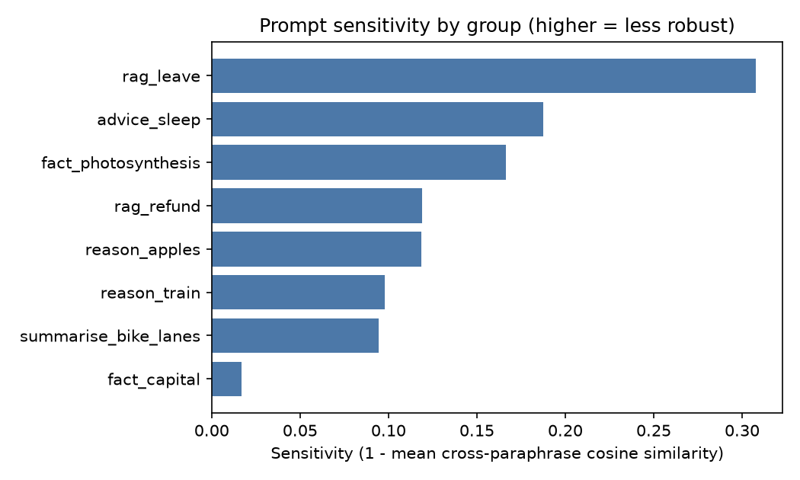
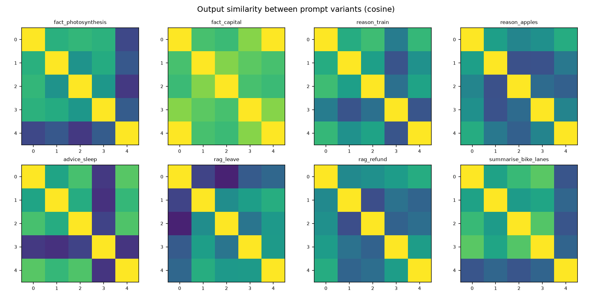

# Prompt Sensitivity Report

## Configuration

- **backend**: ollama:qwen2.5:1.5b
- **temperature**: 0.7
- **n_samples**: 3
- **seed**: 0
- **max_new_tokens**: 64
- **prompt_file**: C:\Users\anush\Downloads\prompt-sensitivity-analyser\prompt-sensitivity-analyser_project\data\prompt_sets.json
- **groups**: 8
- **started**: 2026-09-30T15:08:17
- **embedder**: sentence-transformers:sentence-transformers/all-MiniLM-L6-v2

## Overall

| Metric | Value |
|---|---|
| Groups analysed | 8 |
| Mean sensitivity (1 - cosine) | 0.138  (95% bootstrap CI 0.089 - 0.195) |
| Median / max sensitivity | 0.119 / 0.308 |
| Mean cross-paraphrase output similarity | 0.862 |
| Mean within-paraphrase similarity (sampling noise) | 0.901 |
| Mean excess sensitivity (within - between) | 0.040 |
| Mean lexical (Jaccard) similarity | 0.450 |
| Mean exact-match rate across paraphrases | 0.028 |
| Prompt-sim vs output-sim Spearman (pooled) | 0.391 |
| Mean reference-similarity spread | 0.095 |

## Per-group results (most sensitive first)

| Group | Category | Sensitivity | Min pair sim | Within sim | Excess | Lexical sim | Exact match | Fragile variant |
|---|---|---|---|---|---|---|---|---|
| rag_leave | rag_style | 0.308 | 0.531 | 0.793 | 0.101 | 0.284 | 0.00 | v0 |
| advice_sleep | open_ended | 0.188 | 0.695 | 0.838 | 0.026 | 0.536 | 0.00 | v3 |
| fact_photosynthesis | factual | 0.166 | 0.745 | 0.892 | 0.059 | 0.294 | 0.00 | v4 |
| rag_refund | rag_style | 0.119 | 0.841 | 0.947 | 0.066 | 0.336 | 0.00 | v2 |
| reason_apples | reasoning | 0.119 | 0.848 | 0.894 | 0.013 | 0.399 | 0.00 | v2 |
| reason_train | reasoning | 0.098 | 0.857 | 0.947 | 0.045 | 0.443 | 0.00 | v3 |
| summarise_bike_lanes | summarisation | 0.094 | 0.860 | 0.908 | 0.003 | 0.618 | 0.00 | v4 |
| fact_capital | factual | 0.017 | 0.976 | 0.990 | 0.007 | 0.691 | 0.22 | v2 |

## Most fragile prompts

### rag_leave — sensitivity 0.308

| Var | Mean sim to others | Prompt | Output (sample 0) |
|---|---|---|---|
| v0 | 0.601 | Context: Employees receive 20 days of paid leave per year. Up to 5 un… | 5 |
| v1 | 0.725 | Context: Employees receive 20 days of paid leave per year. Up to 5 un… | The carry-forward limit for unused leave is 5 days. |
| v2 | 0.678 | Context: Employees receive 20 days of paid leave per year. Up to 5 un… | Yes, you can carry over unused leave days. If you have not used any o… |
| v3 | 0.712 | Using only the context below, answer the question. ⏎ Context: Employe… | 5 leave days may be carried forward. |
| v4 | 0.746 | Question: How many unused leave days can be carried forward? ⏎ Contex… | Based on the context provided, employees can carry forward a maximum … |

### advice_sleep — sensitivity 0.188

| Var | Mean sim to others | Prompt | Output (sample 0) |
|---|---|---|---|
| v0 | 0.840 | How can I improve my sleep quality? | Improving sleep quality can be achieved through several effective str… |
| v1 | 0.824 | Give me tips for sleeping better. | Certainly! Here are some tips for improving your sleep quality: ⏎  ⏎ … |
| v2 | 0.846 | What should I do to get better sleep at night? | Getting better sleep can significantly improve your overall health an… |
| v3 | 0.704 | I have trouble sleeping. Any advice? | I'm sorry to hear that you're having trouble sleeping. Here are a few… |
| v4 | 0.848 | List ways to improve the quality of my sleep. | Improving the quality of your sleep can significantly enhance your ov… |

### fact_photosynthesis — sensitivity 0.166

| Var | Mean sim to others | Prompt | Output (sample 0) |
|---|---|---|---|
| v0 | 0.860 | What is photosynthesis? | Photosynthesis is the process by which plants, algae, and some bacter… |
| v1 | 0.851 | Explain photosynthesis. | Photosynthesis is the process by which plants, algae, and some bacter… |
| v2 | 0.838 | Can you tell me what photosynthesis is? | Photosynthesis is the process by which plants, algae, and some bacter… |
| v3 | 0.853 | Describe the process of photosynthesis in plants. | Photosynthesis is a process used by plants to convert light energy in… |
| v4 | 0.768 | In simple terms, how do plants make food from sunlight? | Plants make food from sunlight through a process called photosynthesi… |

## Figures

## How to read this

* **Sensitivity** is `1 - mean cosine similarity` between output embeddings of *different* paraphrases. 0 means outputs are semantically identical regardless of wording; larger means wording changes the answer.
* **Within sim / Excess** separate wording effects from sampling randomness. Run with `--temperature 0.7 --n-samples 3` (or more) to populate them: if paraphrase outputs are no less similar than repeated samples of one prompt (excess ≈ 0), the model is robust.
* **Prompt-sim vs output-sim Spearman** > 0 means prompts that are worded more differently produce more different outputs.
* Embedding similarity measures *semantic closeness of outputs*, not correctness. Add a `reference` answer per group to also get `reference_sim_*` (does wording change how close the answer is to the gold answer?).
* Absolute values depend on the embedder; compare models/prompts using the **same** embedder and dataset.
