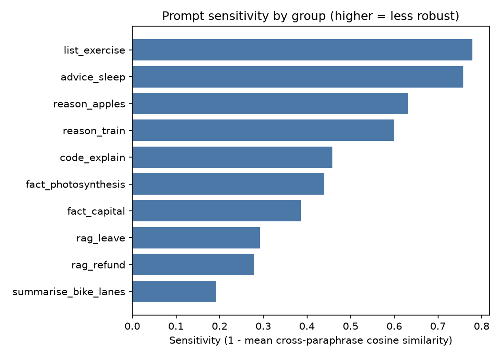
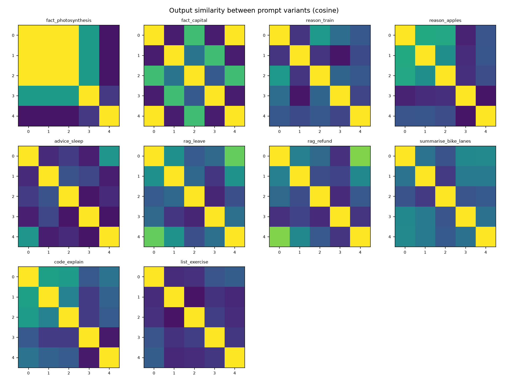

# Prompt Sensitivity Report

## Configuration

- **backend**: mock
- **temperature**: 0.7
- **n_samples**: 3
- **seed**: 0
- **max_new_tokens**: 64
- **prompt_file**: C:\Users\anush\Downloads\prompt-sensitivity-analyser\prompt-sensitivity-analyser_project\data\prompt_sets.json
- **groups**: 10
- **started**: 2026-09-30T14:30:50
- **embedder**: hashing-1024

## Overall

| Metric | Value |
|---|---|
| Groups analysed | 10 |
| Mean sensitivity (1 - cosine) | 0.482  (95% bootstrap CI 0.364 - 0.605) |
| Median / max sensitivity | 0.449 / 0.779 |
| Mean cross-paraphrase output similarity | 0.518 |
| Mean within-paraphrase similarity (sampling noise) | 0.810 |
| Mean excess sensitivity (within - between) | 0.292 |
| Mean lexical (Jaccard) similarity | 0.524 |
| Mean exact-match rate across paraphrases | 0.069 |
| Prompt-sim vs output-sim Spearman (pooled) | 0.806 |
| Mean reference-similarity spread | 0.067 |

## Per-group results (most sensitive first)

| Group | Category | Sensitivity | Min pair sim | Within sim | Excess | Lexical sim | Exact match | Fragile variant |
|---|---|---|---|---|---|---|---|---|
| list_exercise | instruction | 0.779 | 0.122 | 0.643 | 0.422 | 0.240 | 0.00 | v1 |
| advice_sleep | open_ended | 0.758 | 0.137 | 0.628 | 0.386 | 0.247 | 0.00 | v3 |
| reason_apples | reasoning | 0.632 | 0.161 | 0.855 | 0.487 | 0.349 | 0.00 | v3 |
| reason_train | reasoning | 0.600 | 0.241 | 0.777 | 0.377 | 0.405 | 0.00 | v1 |
| code_explain | code | 0.458 | 0.370 | 0.742 | 0.200 | 0.557 | 0.02 | v3 |
| fact_photosynthesis | factual | 0.440 | 0.174 | 0.865 | 0.306 | 0.530 | 0.30 | v4 |
| fact_capital | factual | 0.387 | 0.400 | 0.840 | 0.227 | 0.678 | 0.36 | v3 |
| rag_leave | rag_style | 0.293 | 0.590 | 0.907 | 0.200 | 0.708 | 0.01 | v2 |
| rag_refund | rag_style | 0.280 | 0.639 | 0.918 | 0.197 | 0.722 | 0.00 | v3 |
| summarise_bike_lanes | summarisation | 0.192 | 0.754 | 0.926 | 0.118 | 0.806 | 0.00 | v2 |

## Most fragile prompts

### list_exercise — sensitivity 0.779

| Var | Mean sim to others | Prompt | Output (sample 0) |
|---|---|---|---|
| v0 | 0.264 | List three benefits of regular exercise. | Answer: exercise regular three |
| v1 | 0.173 | Name 3 benefits of exercising regularly. | Answer: 3 exercising regularly |
| v2 | 0.190 | What are three advantages of working out consistently? | Answer: consistently out three working |
| v3 | 0.247 | Give me three reasons to exercise regularly. | Answer: reasons regularly three |
| v4 | 0.232 | Provide three health benefits of regular physical activity. | Answer: activity health physical regular three |

### advice_sleep — sensitivity 0.758

| Var | Mean sim to others | Prompt | Output (sample 0) |
|---|---|---|---|
| v0 | 0.295 | How can I improve my sleep quality? | Answer: improve quality |
| v1 | 0.241 | Give me tips for sleeping better. | Answer: better sleeping |
| v2 | 0.226 | What should I do to get better sleep at night? | Answer: better get sleep |
| v3 | 0.183 | I have trouble sleeping. Any advice? | Answer: advice have trouble |
| v4 | 0.266 | List ways to improve the quality of my sleep. | Answer: improve quality ways |

### reason_apples — sensitivity 0.632

| Var | Mean sim to others | Prompt | Output (sample 0) |
|---|---|---|---|
| v0 | 0.461 | Tom has 5 apples, buys 3 more, then eats 2. How many apples does he h… | Answer: 2 3 5 apples buys eats has have many more now then tom |
| v1 | 0.444 | Tom starts with 5 apples. He buys 3 more and eats 2. How many are lef… | Answer: 2 3 5 apples buys eats he many more starts tom |
| v2 | 0.439 | How many apples does Tom have if he begins with 5, gets 3 more, and t… | Answer: 2 3 5 apples eats gets have he if many more then tom |
| v3 | 0.204 | Tom had five apples, bought three more and ate two. What is his apple… | Answer: apple apples ate bought count five his more three tom two |
| v4 | 0.294 | After owning 5 apples, purchasing 3 further ones and consuming 2, how… | Answer: 2 3 5 after apples consuming further hold many ones purchasin… |

## Figures

## How to read this

* **Sensitivity** is `1 - mean cosine similarity` between output embeddings of *different* paraphrases. 0 means outputs are semantically identical regardless of wording; larger means wording changes the answer.
* **Within sim / Excess** separate wording effects from sampling randomness. Run with `--temperature 0.7 --n-samples 3` (or more) to populate them: if paraphrase outputs are no less similar than repeated samples of one prompt (excess ≈ 0), the model is robust.
* **Prompt-sim vs output-sim Spearman** > 0 means prompts that are worded more differently produce more different outputs.
* Embedding similarity measures *semantic closeness of outputs*, not correctness. Add a `reference` answer per group to also get `reference_sim_*` (does wording change how close the answer is to the gold answer?).
* Absolute values depend on the embedder; compare models/prompts using the **same** embedder and dataset.
