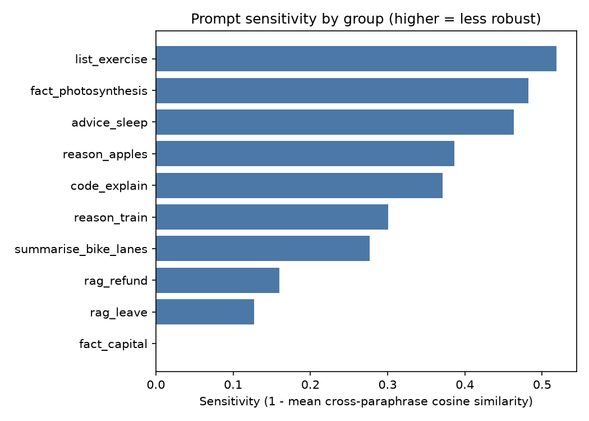
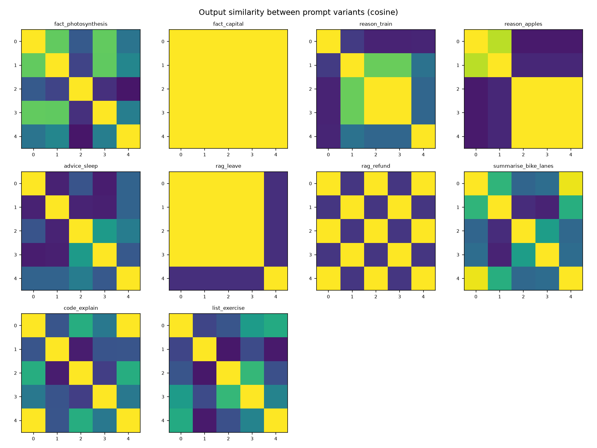

# Prompt Sensitivity Report

## Configuration

- **backend**: hf:google/flan-t5-base
- **temperature**: 0.0
- **n_samples**: 1
- **seed**: 0
- **max_new_tokens**: 128
- **prompt_file**: C:\Users\anush\Downloads\prompt-sensitivity-analyser\prompt-sensitivity-analyser_project\data\prompt_sets.json
- **groups**: 10
- **started**: 2026-09-30T14:31:52
- **embedder**: sentence-transformers:sentence-transformers/all-MiniLM-L6-v2

## Overall

| Metric | Value |
|---|---|
| Groups analysed | 10 |
| Mean sensitivity (1 - cosine) | 0.309  (95% bootstrap CI 0.208 - 0.401) |
| Median / max sensitivity | 0.336 / 0.518 |
| Mean cross-paraphrase output similarity | 0.691 |
| Mean within-paraphrase similarity (sampling noise) | n/a |
| Mean excess sensitivity (within - between) | n/a |
| Mean lexical (Jaccard) similarity | 0.392 |
| Mean exact-match rate across paraphrases | 0.250 |
| Prompt-sim vs output-sim Spearman (pooled) | 0.263 |
| Mean reference-similarity spread | 0.224 |

## Per-group results (most sensitive first)

| Group | Category | Sensitivity | Min pair sim | Within sim | Excess | Lexical sim | Exact match | Fragile variant |
|---|---|---|---|---|---|---|---|---|
| list_exercise | instruction | 0.518 | 0.270 | n/a | n/a | 0.100 | 0.00 | v1 |
| fact_photosynthesis | factual | 0.482 | 0.213 | n/a | n/a | 0.051 | 0.00 | v2 |
| advice_sleep | open_ended | 0.463 | 0.432 | n/a | n/a | 0.153 | 0.00 | v1 |
| reason_apples | reasoning | 0.386 | 0.356 | n/a | n/a | 0.419 | 0.30 | v0 |
| code_explain | code | 0.371 | 0.422 | n/a | n/a | 0.421 | 0.10 | v1 |
| reason_train | reasoning | 0.300 | 0.545 | n/a | n/a | 0.300 | 0.10 | v0 |
| summarise_bike_lanes | summarisation | 0.277 | 0.555 | n/a | n/a | 0.345 | 0.00 | v2 |
| rag_refund | rag_style | 0.160 | 0.733 | n/a | n/a | 0.400 | 0.40 | v1 |
| rag_leave | rag_style | 0.127 | 0.683 | n/a | n/a | 0.733 | 0.60 | v4 |
| fact_capital | factual | -0.000 | 1.000 | n/a | n/a | 1.000 | 1.00 | v0 |

## Most fragile prompts

### list_exercise — sensitivity 0.518

| Var | Mean sim to others | Prompt | Output (sample 0) |
|---|---|---|---|
| v0 | 0.538 | List three benefits of regular exercise. | Exercise increases heart health |
| v1 | 0.332 | Name 3 benefits of exercising regularly. | a healthier body a healthier mind |
| v2 | 0.461 | What are three advantages of working out consistently? | It helps you stay fit |
| v3 | 0.588 | Give me three reasons to exercise regularly. | Exercise helps you stay fit and healthy. |
| v4 | 0.488 | Provide three health benefits of regular physical activity. | Exercise increases blood flow to the body |

### fact_photosynthesis — sensitivity 0.482

| Var | Mean sim to others | Prompt | Output (sample 0) |
|---|---|---|---|
| v0 | 0.621 | What is photosynthesis? | photosynthesis |
| v1 | 0.620 | Explain photosynthesis. | Photosynthesis is the process of photosynthesis converting sunlight i… |
| v2 | 0.307 | Can you tell me what photosynthesis is? | a chemical reaction |
| v3 | 0.599 | Describe the process of photosynthesis in plants. | Photosynthesis occurs when the plant absorbs sunlight and metabolizes… |
| v4 | 0.442 | In simple terms, how do plants make food from sunlight? | absorbing sunlight |

### advice_sleep — sensitivity 0.463

| Var | Mean sim to others | Prompt | Output (sample 0) |
|---|---|---|---|
| v0 | 0.498 | How can I improve my sleep quality? | Try a nighttime slumber party. |
| v1 | 0.474 | Give me tips for sleeping better. | Sleeping with a pillow is a good way to help you fall asleep. |
| v2 | 0.587 | What should I do to get better sleep at night? | Try to sleep in the middle of the night. |
| v3 | 0.536 | I have trouble sleeping. Any advice? | I should try to sleep in the morning. |
| v4 | 0.588 | List ways to improve the quality of my sleep. | Sleeping in the middle of the night is a bad idea. |

## Figures

## How to read this

* **Sensitivity** is `1 - mean cosine similarity` between output embeddings of *different* paraphrases. 0 means outputs are semantically identical regardless of wording; larger means wording changes the answer.
* **Within sim / Excess** separate wording effects from sampling randomness. Run with `--temperature 0.7 --n-samples 3` (or more) to populate them: if paraphrase outputs are no less similar than repeated samples of one prompt (excess ≈ 0), the model is robust.
* **Prompt-sim vs output-sim Spearman** > 0 means prompts that are worded more differently produce more different outputs.
* Embedding similarity measures *semantic closeness of outputs*, not correctness. Add a `reference` answer per group to also get `reference_sim_*` (does wording change how close the answer is to the gold answer?).
* Absolute values depend on the embedder; compare models/prompts using the **same** embedder and dataset.
